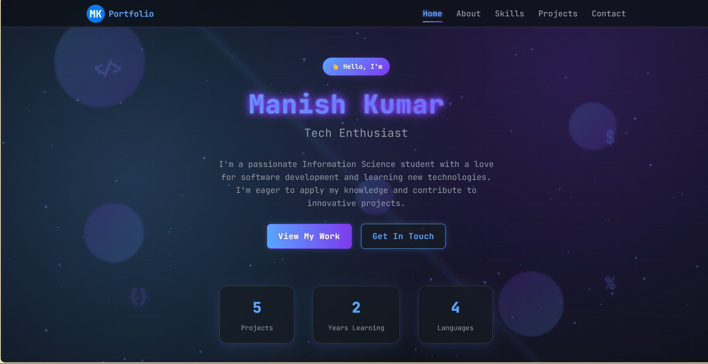

# My Portfolio

A modern, responsive portfolio website built with React and Vite.

## 🚀 Live Demo

[View Portfolio Live](https://your-vercel-url.vercel.app)

## ✨ Features

- Responsive design for all devices
- Animated hero section and background
- Projects showcase with tech stack
- Contact form
- Smooth scrolling and interactive UI

## 🛠️ Built With

- React
- Vite
- CSS (custom, no frameworks)
- [Vercel](https://vercel.com/) for hosting

## 🛠️ Technologies Used

- **React** – Frontend library for building user interfaces
- **Vite** – Fast build tool and development server
- **CSS3** – Custom styles for layout and animations
- **JavaScript (ES6+)** – Application logic
- **Vercel** – Hosting and deployment
- **Google Fonts** – Custom fonts for typography
- **SVG** – For icons and graphics

## 🎨 UI/UX Features

- **Responsive Design:** Looks great on all devices (desktop, tablet, mobile)
- **Animated Hero Section:** Eye-catching introduction with typewriter and rotating titles
- **Glassy Navbar & Cards:** Modern glassmorphism effects for navigation and project cards
- **Animated Background:** Subtle moving particles and floating shapes
- **Smooth Scrolling:** Seamless navigation between sections
- **Hover Effects:** Interactive feedback on buttons and cards
- **Dark Theme:** Modern, developer-friendly color palette
- **Accessible:** Keyboard navigation and semantic HTML

## 📸 Screenshots

<!-- Add screenshots here -->


## 📦 Setup

```bash
git clone https://github.com/yourusername/your-repo-name.git
cd your-repo-name
npm install
npm run dev
```

---

**Made with ❤️ by [MANISH KUMAR](https://your-link.com)**
